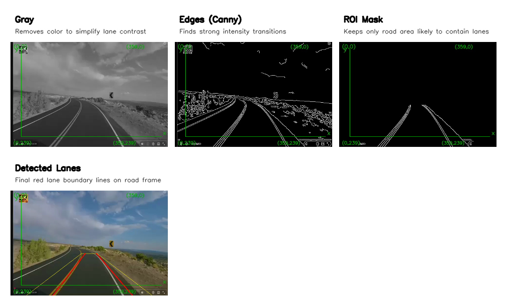
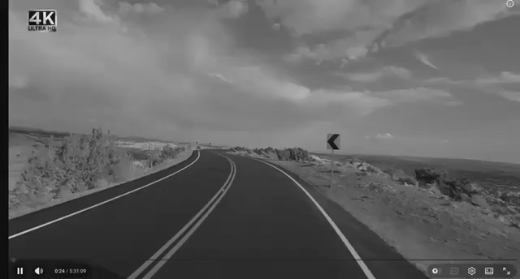
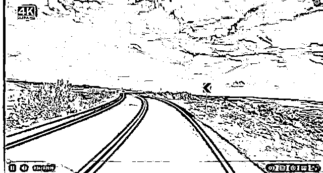
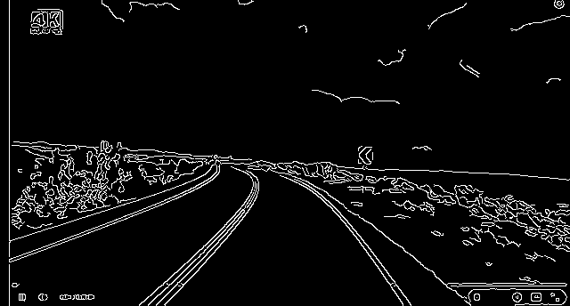
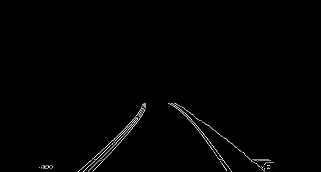
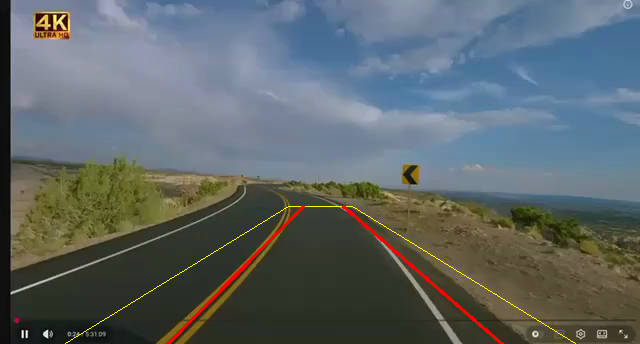

# Lane Detection Results

This project detects lane boundaries from a road video using grayscale/adaptive preprocessing, edge detection, ROI masking, and line fitting.  
The final output draws lane edges in red and the ROI trapezoid border in yellow.

## Set Up & Requirements

- Python 3.9+ (recommended)
- `opencv-python`
- `numpy`

Install dependencies:

```bash
pip install opencv-python numpy
```

Optional:
- Use a virtual environment in VS Code for dependency isolation.

## How To Run

From the project folder:

```bash
python lane_detection.py /Users/lindaperez/Documents/COMPUTER_VISION/Week7_0309/mini-project6/video/road.mp4 --no-display
```

Enable adaptive thresholding:

```bash
python lane_detection.py /Users/lindaperez/Documents/COMPUTER_VISION/Week7_0309/mini-project6/video/road.mp4 --no-display --use-adaptive-threshold
```

Use a custom outputs folder and explicit output video path:

```bash
python lane_detection.py /Users/lindaperez/Documents/COMPUTER_VISION/Week7_0309/mini-project6/video/road.mp4 --no-display --outputs-dir my_out -o my_out/final.mp4
```

## Output Summary

- `road_gray.png`: grayscale frame used to simplify intensity processing.
- `road_adaptive_threshold.png`: local thresholding result (used when adaptive mode is enabled).
- `road_edges.png`: Canny edge map.
- `road_roi.png`: edges limited to the trapezoid road region.
- `road_lane_overlay.png`: final detected lane edges on the road frame.
- `road_pipeline_overview.png`: combined panel with all stages and short explanations.
- `road_lanes.mp4`: full processed output video.

## Pipeline Overview



## Stage Images

### Grayscale


### Adaptive Threshold


### Edge Detection (Canny)


### ROI Mask


### Final Lane Detection


## Result Video

[Open processed video](outputs/road_lanes.mp4)

## Evaluation Technique and Result

### Technique

1. Qualitative visual evaluation:
- Inspect `road_pipeline_overview.png` and `road_lanes.mp4` to verify that:
  - left and right lane borders are highlighted in red,
  - the ROI trapezoid border is shown in yellow,
  - detections remain consistent across frames.

2. Quantitative frame-level evaluation (implemented in script):
- Run with `--frame-check-report` to produce a per-frame CSV:

```bash
python lane_detection.py /Users/lindaperez/Documents/COMPUTER_VISION/Week7_0309/mini-project6/video/road.mp4 --no-display --frame-check-report
```

- Output file: `outputs/road_frame_check.csv`
- Reported fields per frame:
  - `left_detected`
  - `right_detected`
  - `both_detected`
  - `geometry_ok`
  - `lane_width_px`

### Result

- Current qualitative result: lane borders are detected and rendered on the sample outputs (`road_lane_overlay.png` and `road_lanes.mp4`).
- Quantitative result: generate and summarize from `outputs/road_frame_check.csv` after running the command above.

## Next Steps

Already implemented in this version:
- Temporal smoothing across frames to reduce lane jitter.
- Resolution/camera-position-aware Canny and Hough tuning.
- Curved-lane fitting (polynomial) with straight-line fallback.

Planned improvements:
- Improve robustness to shadows and glare with CLAHE or color-space filtering (HLS/HSV).
- Add confidence scoring to suppress false positives when lane evidence is weak.
- Add lane-width and curvature consistency checks across time.
- Add quantitative evaluation against labeled ground truth (precision/recall, IoU).
- Add support for perspective transform (bird’s-eye view) for more stable lane geometry.
